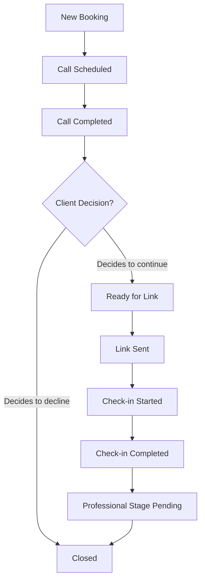

# Inward Centre Clinic Website — MVP

This repository contains the static-rendered Next.js MVP website for **Inward** (`INWARD CENTRE INC.`), located in British Columbia, Canada.

The website is designed to serve as a warm, calm, privacy-conscious portal. Its primary business objective is to onboard clients by prompting them to book a 15-minute administrative onboarding call.

---

## Technical Stack

- **Framework**: Next.js (App Router, static rendering wherever possible)
- **Language**: TypeScript
- **Styling**: Tailwind CSS v4 (configured inside `src/app/globals.css` with a custom CSS custom-property design system)
- **Icons**: Scalable React SVGs (`src/components/icons/Icons.tsx`)
- **Logo**: Custom vector SVG symbol (`src/components/icons/InwardLogo.tsx`) representing a head silhouette, inquiry question mark, and structured check-in check mark.

---

## Local Development Setup

To run the project locally, follow these steps:

1. **Install dependencies**:
   ```bash
   npm install
   ```

2. **Configure environment variables**:
   Create a `.env.local` file in the root directory and add the external scheduling URL:
   ```env
   NEXT_PUBLIC_BOOKING_URL=https://calendly.com/your-booking-link-here
   NEXT_PUBLIC_SITE_URL=https://inwardcentre.ca
   ```

3. **Start the local dev server**:
   ```bash
   npm run dev
   ```
   Open [http://localhost:3000](http://localhost:3000) in your browser.

4. **Verify production build**:
   ```bash
   npm run build
   ```

---

## Site Configuration & Content Editing

All key copy and feature toggles are centralized in the site configuration file:
👉 **[site-config.ts](file:///c:/Projects/Inward/src/config/site-config.ts)**

Central parameters you can edit:

| Variable | Type | Default | Description |
| :--- | :--- | :--- | :--- |
| `companyName` | `string` | `"INWARD CENTRE INC."` | Legal corporate name used in legal notices & footer. |
| `brandName` | `string` | `"Inward"` | Public customer-facing brand name. |
| `serviceStatus` | `'prelaunch' \| 'live'` | `'prelaunch'` | Toggles step 4 copy and FAQ review wording dynamically. |
| `bookingUrl` | `string` | `process.env.NEXT_PUBLIC_BOOKING_URL` | External scheduling system address. |
| `businessEmail` | `string` | `"info@inwardcentre.ca"` | Public contact email in header/footer/FAQ. |
| `privacyEmail` | `string` | `"privacy@inwardcentre.ca"` | Privacy inquiries and compliance point of contact. |
| `showInsuranceSection` | `boolean` | `false` | Toggles rendering of Section 7 (Extended Health benefits). |
| `showDirectBilling` | `boolean` | `false` | Toggles showing direct billing statements when insurance is active. |
| `showFees` | `boolean` | `false` | Placeholder for pricing table toggles. |
| `showTeam` | `boolean` | `false` | Controls rendering of team sections (should remain false at launch). |
| `provinceAvailability`| `string[]` | `["British Columbia"]` | Configures geographic bounds for services. |

---

## Administrative Booking Workflow

Clients do not create accounts or passwords. The administrative team manages client onboarding manually following this lifecycle:



### Administrative Call Status Checklist
Administrators can track calls in internal clinic systems using these labels:
1. `New booking` — Booking form received via booking provider.
2. `Call scheduled` — Invite sent and confirmed.
3. `Call completed` — 15-minute onboarding conversation conducted.
4. `Waiting for client decision` — Client reviewing terms/pricing post-call.
5. `Ready for link` — Administrator registers client details inside clinic systems.
6. `Link sent` — Private, random high-entropy checkout/check-in link generated and emailed.
7. `Check-in started` — Client opens link.
8. `Check-in completed` — Client answers submitted securely (bypassing public website log files).
9. `Professional stage pending` — Data routed to registered clinician for review.
10. `Closed` — Process completed.

---

## Onboarding Call Script Guidelines

Onboarding staff must review these boundaries prior to handling calls:

- **Opening Frame**:
  > "Thank you for booking with Inward. This is a short 15-minute administrative call to explain how the service works, answer practical questions, and organize the next step. It is not a therapy or clinical consultation."
  
- **Confirm Details**:
  - Full client name, email, phone number, and residency in British Columbia.
  - Understanding of pricing, general insurance rules (avoiding guarantees), and consent to receive the check-in link.
  
- **Prohibited Conduct**:
  - **Do NOT** diagnose, interpret symptoms, recommend specific treatments, or guarantee insurance coverage.
  - **Do NOT** represent yourself as a therapist or discuss clinical results.

---

## Future Practitioner Activation Checklist

When the clinical team is active and verified, follow this checklist to enable practitioner profiles:

- [ ] Obtain legal names, professional designations, licensing boards, registration numbers, and digital headshots for all active clinicians.
- [ ] Confirm clinic-level professional liability insurance is active and active clinical guidelines are verified.
- [ ] In `src/config/site-config.ts`, set `showTeam = true`.
- [ ] In `src/config/site-config.ts`, set `serviceStatus = 'live'` (this automatically switches Step 4 copy and FAQ answers to reflect registered professional review).
- [ ] Update index layout `src/app/page.tsx` to map array of active clinicians to the **[PractitionerCard](file:///c:/Projects/Inward/src/components/PractitionerCard.tsx)** component in a grid.
- [ ] Switch SEO structured data from `Organization` to `MedicalClinic` if certified by legal counsel.

---

## Deployment to Vercel

This application is ready for Vercel deployment:

1. Import the repository into your Vercel Dashboard.
2. Set the Environment Variables under Project Settings:
   - `NEXT_PUBLIC_BOOKING_URL` (external scheduler endpoint)
   - `NEXT_PUBLIC_SITE_URL` (e.g., `https://inwardcentre.ca`)
3. Click **Deploy**. Vercel will automatically build the static pages.
